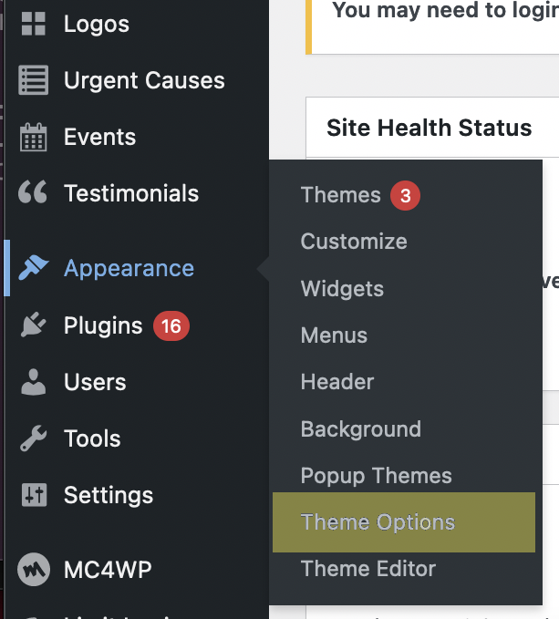

# Information

- Author: Taylor Dean
- Version: 1.0
- Creation Date: 11/19/2021

## Table of Contents

1. [The Homepage](#homepage)
2. [Events Page](#events)

## Homepage 

The WordPress homepage is interacted with differently to the rest of the site. To get started with making changes to the page, you will need to go into Appearance -> Theme Options in the WordPress dashboard sidebar.

Instead of using a WYSIWYG editor or block editor for example, the homepage is divided into Sections that you can click into and edit.
